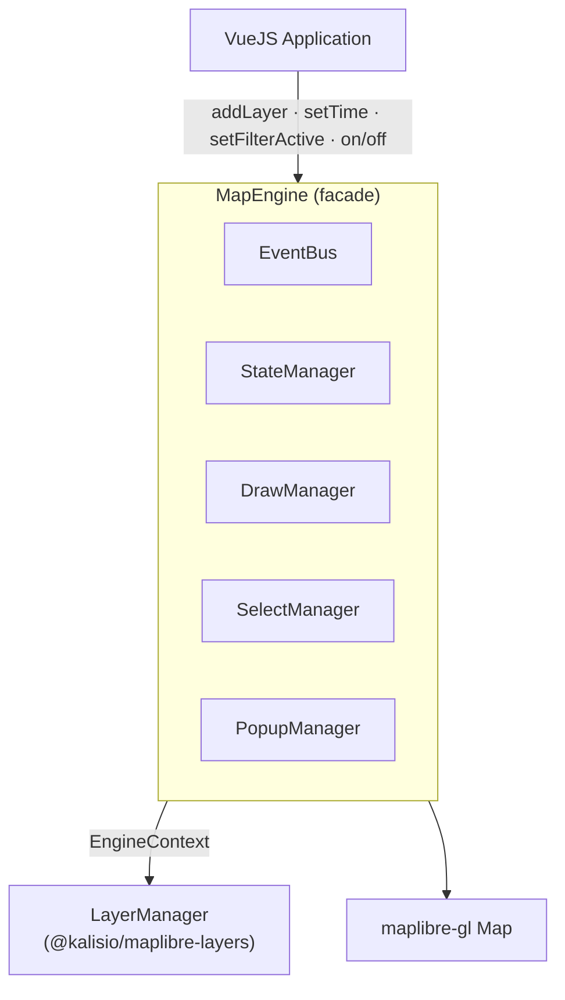

# maplibre-core

_Core package for Kalisio map engine based on MapLibre_

## Overview

`maplibre-core` exposes a single class, [`MapEngine`](#mapengine), which is the **only** entry point a host application (typically a Vue component) needs. It wraps a MapLibre GL JS map instance and orchestrates every other package in the ecosystem — `@kalisio/maplibre-layers` for layers, `@kalisio/maplibre-interactions` for draw/select/popup — behind one façade, so the host application never imports MapLibre GL JS, deck.gl, or Three.js directly.



Two design choices shape the whole package:

- **One-way state ownership.** `StateManager` only holds state that is genuinely global to the engine: the current time, the application default style, and the current 2D/3D render mode. It knows nothing about individual layers — that state lives in `@kalisio/maplibre-layers` (see [its architecture doc](/packages/maplibre-layers/architecture) for why).
- **Narrow context, not raw managers.** `MapEngine` never hands its `StateManager` instance to `LayerManager`. It wraps it in an `EngineContext` (from `@kalisio/maplibre-layers`) that only exposes the three getters `LayerManager` actually needs (`isRenderMode2D()`, `getTime()`, `getAppDefaultStyle()`). This is deliberate: it keeps `LayerManager` from being able to reach into state it has no business mutating.

## Installation

Install with your preferred package manager:

::: code-group

```bash [pnpm]
pnpm add @kalisio/maplibre-core
```

```bash [npm]
npm install @kalisio/maplibre-core
```

```bash [yarn]
yarn add @kalisio/maplibre-core
```

:::

## Quick start

```js
import { MapEngine } from '@kalisio/maplibre-core'

const engine = new MapEngine(containerRef.value, {
  style: 'https://demotiles.maplibre.org/style.json',
  center: [2.3522, 48.8566],
  zoom: 10,
})

engine.on('layer:added', (e) => console.log('Layer added:', e.layerId))

await engine.addLayer({
  id: 'cities',
  type: 'vector',
  url: 'https://example.com/cities.geojson',
  style: { type: 'circle', color: '#e74c3c' },
})

// Always release resources when the host component unmounts
onUnmounted(() => engine.destroy())
```

## `MapEngine`

### Constructor

```js
new MapEngine(container: HTMLElement, options?: {
  style?: string | object,       // defaults to the MapLibre demo style
  center?: [number, number],     // defaults to [0, 0]
  zoom?: number,                 // defaults to 2
  minZoom?: number,
  maxZoom?: number,
  navigationControl?: boolean,   // defaults to true
  scaleControl?: boolean,        // defaults to false
})
```

### Lifecycle

| Method | Description |
|---|---|
| `destroy()` | Releases every internal subsystem and removes the MapLibre map. Emits `'engine:destroy'` first, so listeners can clean up before teardown. |
| `resize()` | Notifies MapLibre that the container size changed. |
| `on(event, callback)` / `off(event, callback)` | Subscribe/unsubscribe to engine events (see [Events](#events)). |

### Layers

| Method | Description |
|---|---|
| `addLayer(definition)` | Adds a layer from its business definition. `definition.id` and `definition.type` are required. Returns a `Promise`; rejects (and emits `'layer:error'`) if the layer could not be added. |
| `removeLayer(id)` | Removes a layer and releases its resources. |
| `setLayerVisibility(id, visible)` | Toggles a layer's visibility. |
| `setLayerLevel(id, level)` | Selects a vertical level for a multi-dimensional layer (Kazarr-backed layers). |
| `getLayerLevels(id)` | ⚠️ Not implemented yet — always returns `[]` (see the `TODO` in `MapEngine.js`). |
| `getCoordinates(id)` / `getVariables(id)` / `getCoordinate(id, name)` | Multi-dimensional metadata accessors, delegated to the layer's provider (Kazarr layers). |

See [`maplibre-layers`](/packages/maplibre-layers/) for the full list of supported layer `type`s and what a `definition` looks like for each.

### Time & filtering

| Method | Description |
|---|---|
| `setTime(time, ids?)` | Applies a new temporal instant, either to every layer or to the given subset of layer ids. Emits `'time:changed'` immediately, then `'time:applied'` once every affected layer has finished updating. |
| `setFilterActive(layerId, filterId, active)` | Activates/deactivates a named business sub-filter declared in the layer's `definition.filters`. |

### Style

| Method | Description |
|---|---|
| `defineDefaultStyle(style)` | Sets the application-wide fallback style, used by any layer that doesn't declare its own `style`. Stored as-is (unparsed) — each layer parses it against its own type when it needs it, since the same raw style can resolve differently for a point vs. a polygon layer. |
| `applyStyle(layerId, style, filterId?)` | Applies a style to a layer, or to one of its named filters. |

### Navigation

`flyTo(lon, lat, zoom?, options?)` · `flyToLayer(layerId, options?)` · `fitBounds(bounds, options?)` · `getBounds()` · `setZoom(zoom)` / `getZoom()` · `setCenter(lon, lat)` / `getCenter()` — thin wrappers around the equivalent MapLibre GL JS calls, so the host application never needs a reference to the underlying `maplibregl.Map`.

### Drawing

`setDrawTool(toolName, options?)` / `stopDrawing()` — delegated to `DrawManager` (see [`maplibre-interactions`](/packages/maplibre-interactions/)).

## Events

`MapEngine` exposes a single, typed, public event bus (`on`/`off`) — this is the **only** channel the host application should ever listen to. Internally, subsystems also talk to each other over MapLibre's own native event bus (`map.fire()`/`map.on()`, namespaced `internal:*`), but that bus is a private implementation detail of `@kalisio/maplibre-layers` and is never meant to be observed from outside the engine.

| Event | Payload | Emitted when |
|---|---|---|
| `engine:ready` | — | The underlying MapLibre map has finished loading. |
| `engine:destroy` | — | `destroy()` was called, before teardown. |
| `engine:error` | `{ message, cause? }` | MapLibre reports an internal error. |
| `engine:render-mode:changed` | `{ mode: '2D' \| '3D' }` | The pitch crosses the 2D/3D threshold (2°). |
| `layer:added` | `{ layerId, layerType }` | `addLayer()` succeeds. |
| `layer:error` | `{ layerId, message, cause? }` | `addLayer()` fails. |
| `layer:removed` | `{ layerId }` | `removeLayer()` was called. |
| `layer:visibility` | `{ layerId, visible }` | `setLayerVisibility()` was called. |
| `time:changed` | `{ time }` | `setTime()` is called, before layers have updated. |
| `time:applied` | `{ time, layerIds }` | Every targeted layer has finished its temporal update. |
| `filter:active` | `{ layerId, filterId, active }` | `setFilterActive()` was called. |
| `map:movestart` / `map:moveend` | `{ center, zoom }` (moveend only) | Camera pan. |
| `map:zoomstart` / `map:zoomend` | `{ zoom }` (zoomend only) | Camera zoom. |

`@kalisio/maplibre-interactions` also emits on this same bus: `draw:start`, `draw:stop`, `select:changed`, `map:click`, `feature:click`, `popup:open`, `popup:close` — see [`maplibre-interactions`](/packages/maplibre-interactions/) for their payloads.
