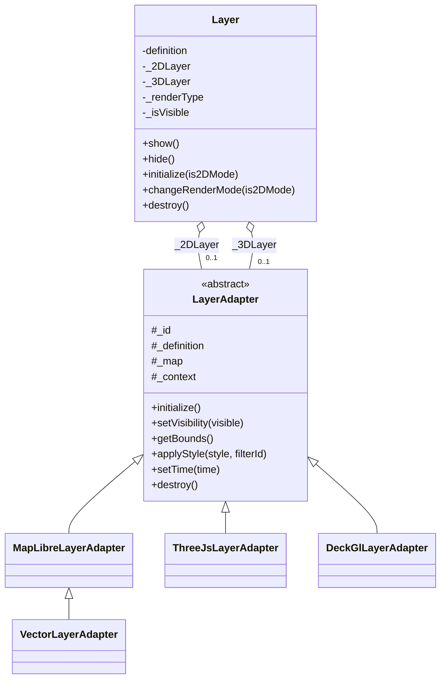
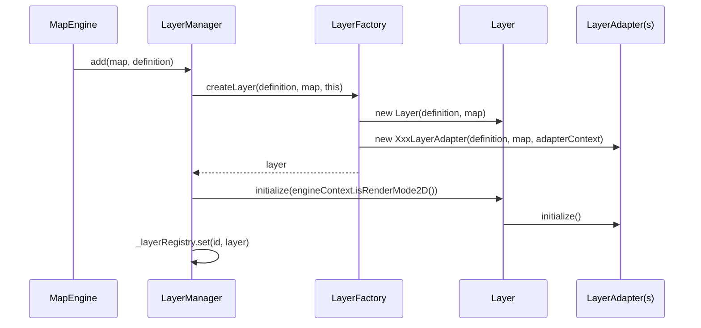
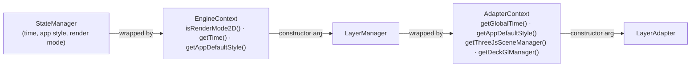

# Architecture

This page documents the internal design of `@kalisio/maplibre-layers` — useful when adding a new layer type or debugging why a layer isn't rendering, but not needed to just *use* the package (see the [index](/packages/maplibre-layers/) for that).

## `Layer` vs. `LayerAdapter`

The central idea is a split between **one business layer** and **its per-rendering-engine implementations**:

- **`Layer`** — one instance per `definition.id`. Composite object holding at most a 2D and a 3D `LayerAdapter`, and choosing which one is active based on the engine's current render mode. This is what `LayerManager._layerRegistry` stores.
- **`LayerAdapter`** — abstract base class for "render this definition using one specific engine": `MapLibreLayerAdapter` (raster/raster-dem/wms), `VectorLayerAdapter` (GeoJSON, extends `MapLibreLayerAdapter`), `ThreeJsLayerAdapter`, `DeckGlLayerAdapter`.

A vector layer, for instance, gets **both** a `VectorLayerAdapter` (2D) and a `ThreeJsLayerAdapter` (3D) — `Layer.getLayer(is2DMode)` returns whichever is active, and `Layer._refreshVisibility()` (triggered on `show()`/`hide()` and on render-mode changes) applies visibility to the right one.

::: tip Naming history
This used to be named the other way round — `MetaLayer` (the composite) and `Layer` (the per-engine base class). It was renamed for clarity: the composite is the one that actually represents "a layer" from the host application's point of view, so it gets the plain name; the per-engine class is explicitly an *adapter*.
:::

## Building a layer: `LayerFactory`

`LayerManager.add()` delegates to `LayerFactory.createLayer(definition, map, layerManager)`, which:

1. Builds one `AdapterContext` wrapping `layerManager` (see [Context objects](#context-objects) below).
2. Creates the composite `Layer`.
3. Based on `definition.type` (and the URL protocol, for `kazarr://` vector layers), constructs the right `LayerAdapter` subclass(es) and attaches them via `layer.set2DLayer()` / `layer.set3DLayer()`.

## Context objects

Neither `LayerManager` nor any `LayerAdapter` ever receives a "God object" giving it access to state or methods it has no business touching. Two small wrapper classes narrow what's handed down:

- **`EngineContext`** (built by `MapEngine`, from `@kalisio/maplibre-layers`) — `LayerManager` receives this instead of the `StateManager` instance, so it can read the render mode/time/default style but can never call `setTime()`, `setAppDefaultStyle()` or `setRenderMode()`.
- **`AdapterContext`** (built by `LayerFactory`, private to this package) — each `LayerAdapter` receives this instead of the `LayerManager` instance, so it can read the global time, the default style, and reach the two scene managers, but can never touch the layer registry, the ordering methods, or other layers.

## The two scene managers

3D content is not created ad hoc by each layer — two managers, both instantiated once per map by `LayerManager.initialize(map)`, own the shared rendering resources:

- **`ThreeJsSceneManager`** — owns the single `THREE.Scene` and the custom MapLibre `'3d'` layer that renders it every frame. `ThreeJsLayerAdapter` calls `setGroup(id, group)` / `setGroupVisibility(id, visible)` / `removeGroup(id)` on it instead of managing its own Three.js scene.
- **`DeckGlManager`** — owns the single deck.gl `MapboxOverlay` control. `DeckGlLayerAdapter` calls `setLayer(id, deckLayer)` / `setLayerVisibility(id, visible)` / `removeLayer(id)` on it instead of managing its own overlay.

Both exist so that **multiple layers of the same 3D kind share one underlying resource** instead of each creating its own — this matters in particular for deck.gl: a `MapboxOverlay` is expensive to duplicate, and a naive one-per-layer approach silently overwrites earlier layers' content. `DeckGlManager` keeps every registered deck.gl layer instance in a `Map` and always calls `setProps({ layers })` with the full current set.

::: tip Lazy by design
Both managers defer registering their MapLibre layer/control until the first 3D layer of their kind is actually added — `DeckGlManager`'s `MapboxOverlay` on the first `setLayer()` call, `ThreeJsSceneManager`'s custom `'3d'` layer on the first `setGroup()` call — instead of doing it eagerly in the constructor.

Each of them hooks a second renderer into MapLibre's own WebGL context and its `render` callback keeps calling `triggerRepaint()` every frame from that point on, even with nothing to draw. Doing that before any layer/camera activity has occurred has been observed to leave GL state dirty until the next full repaint, rendering the base map black — intermittently, since it's a timing race against MapLibre's own first paint of the base style's tiles, not a guaranteed failure — until a pitch/zoom change forces a repaint. Creating either one only once a matching 3D layer actually exists avoids paying that cost for apps that never add one, and avoids the race for apps that do (the renderer only starts running once there's real content to show).
:::

## The internal event bus

Two distinct event channels exist in the engine, on purpose:

- **`EventBus`** (`@kalisio/maplibre-core`) — the *public* contract, exposed to the host application via `MapEngine.on()`/`off()`. Nothing internal is emitted on it.
- **MapLibre's native event bus** (`map.fire()`/`map.on()`) — used for *internal*, many-to-many communication between engine subsystems that already hold a reference to `map` (adapters, managers), so they don't need a direct reference to each other just to react to one event. Names are centralized in `INTERNAL_EVENTS` to avoid a silent typo turning a listener into dead code.

Currently:

| Event | Fired by | Consumed by |
|---|---|---|
| `INTERNAL_EVENTS.RENDER_MODE_CHANGED` | `MapEngine`, on `pitchend` crossing the 2D/3D threshold | `Layer`, to switch its active `LayerAdapter` and refresh visibility |
| `INTERNAL_EVENTS.LAYER_DATA_UPDATED` | `LayerAdapter._loadProviderData()`, after a provider fetch resolves | Not consumed yet — available for a future "loading" indicator or cache invalidation hook |

## Removal & cleanup

`LayerManager.remove(map, id)` calls `layer.destroy()` (the composite), which calls `destroy()` on both its adapters:

- `MapLibreLayerAdapter`/`VectorLayerAdapter` remove their MapLibre sources/layers (and, for vector, DOM cluster markers and the hull source).
- `ThreeJsLayerAdapter` calls `ThreeJsSceneManager.removeGroup(id)`.
- `DeckGlLayerAdapter` calls `DeckGlManager.removeLayer(id)`.

Every adapter is responsible for giving back exactly the resources it acquired in `_initialize()`/`_postInitialize()`.
